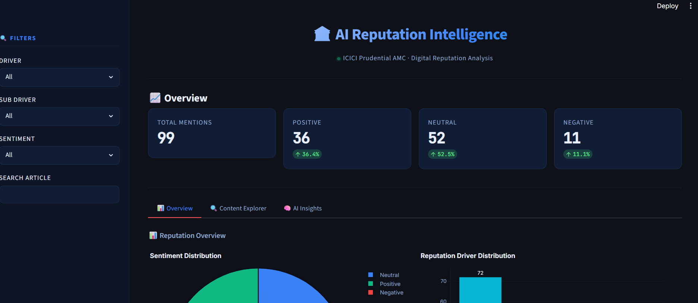
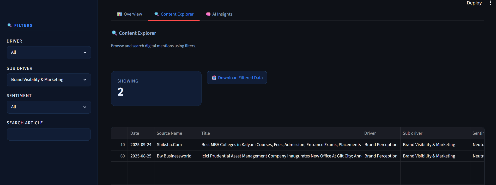
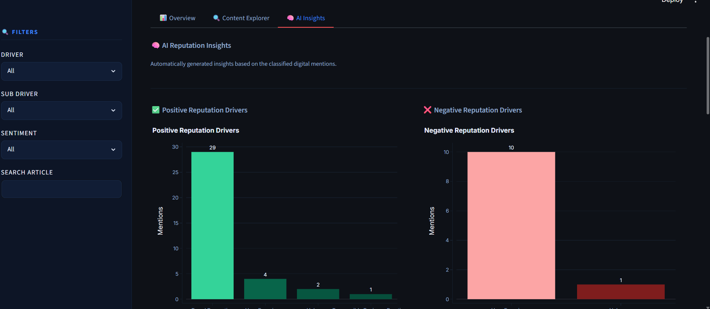
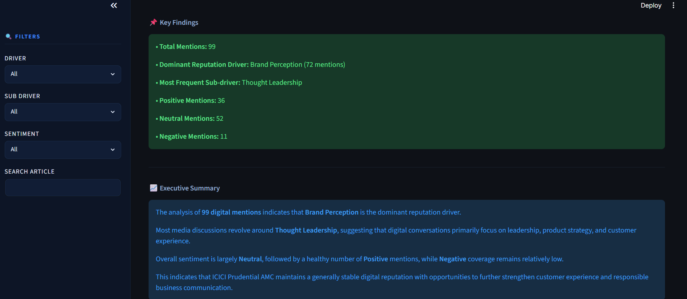
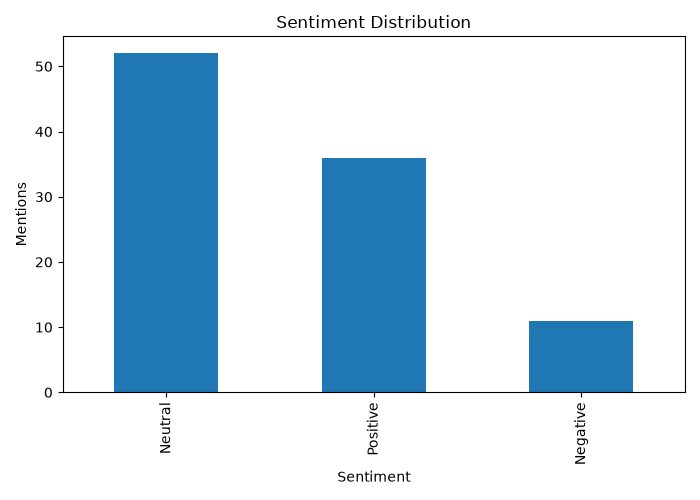
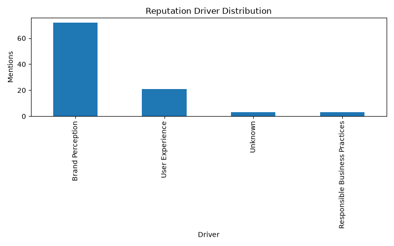
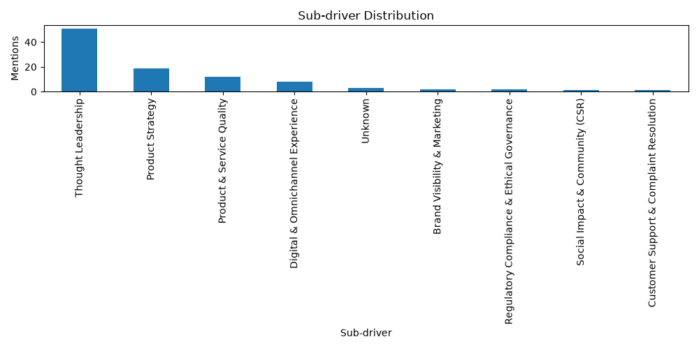
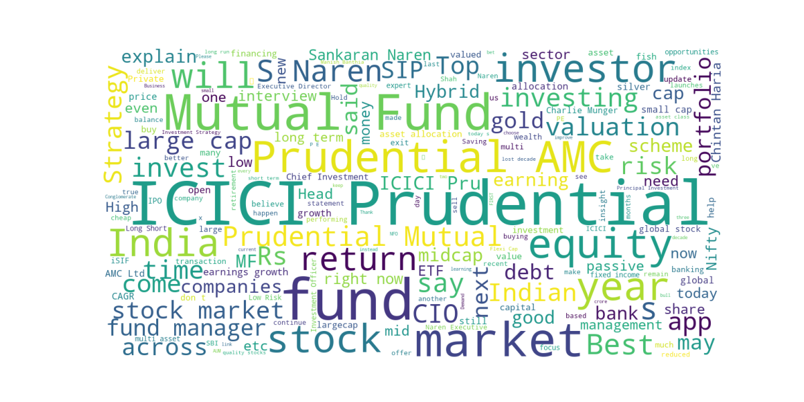

# 🏦 AI Reputation Intelligence Dashboard
DEPLOY LINK- https://ai-reputation-intelligence-dashboard-dheeraj-aiproject.streamlit.app/

<div align="center">

### AI & Data Solutions Specialist Assignment

**AI-Powered Digital Reputation Analysis & Business Intelligence Dashboard**

Developed for **ICICI Prudential Asset Management Company (AMC)**

<br>


</div>

---

## 📖 Project Overview

Organizations generate thousands of digital mentions every day across news portals, blogs, financial websites, and social media. Monitoring this information manually is time-consuming and makes it difficult to identify reputation trends in real time.

This project presents an **AI-powered Reputation Intelligence Dashboard** that automatically analyzes digital media mentions related to **ICICI Prudential AMC**. The application combines data preprocessing, Large Language Model (LLM)-based classification, business insight generation, and interactive visualization to convert unstructured text into meaningful reputation intelligence.

Instead of manually reviewing every article, the system automatically:

- Cleans and prepares raw media data
- Classifies each article using **Mistral AI**
- Maps articles to predefined Reputation Drivers and Sub-drivers
- Generates analytical insights
- Visualizes findings through an interactive Streamlit dashboard

The solution demonstrates an end-to-end AI workflow suitable for reputation monitoring and business intelligence applications.

---

## 🎯 Project Objectives

The primary objectives of this assignment are:

- Develop a complete AI-powered reputation analysis pipeline
- Clean and preprocess raw digital media data
- Automatically classify articles using an LLM
- Categorize articles into Reputation Drivers and Sub-drivers
- Analyze sentiment and reputation trends
- Generate business-ready insights
- Build an interactive dashboard for exploration and reporting
- Design a scalable architecture suitable for future production deployment

---

# 📸 Dashboard Preview

> **Replace the placeholder images below with screenshots from your application.**

---

## Dashboard Overview

<p align="center">

</p>

**Highlights**

- KPI Cards
- Sentiment Distribution
- Driver Distribution
- Sub-driver Distribution
- Word Cloud
- Discussion Themes

---

## Content Explorer

<p align="center">

</p>

**Highlights**

- Search Articles
- Driver Filter
- Sub-driver Filter
- Sentiment Filter
- Original Article Viewer
- Download Filtered Dataset

---

## AI Insights

<p align="center">

</p>

<p align="center">

</p>


**Highlights**

- Positive Reputation Drivers
- Negative Reputation Drivers
- Executive Summary
- Business Recommendations
- Key Findings

---

# 🏗️ Solution Architecture

The application follows a modular pipeline where each stage is responsible for a specific task. This separation improves maintainability, scalability, and future extensibility.


### Architecture Flow

```text
                    Raw Dataset
                         │
                         ▼
               Data Preprocessing
                         │
                         ▼
              Text Normalization
                         │
                         ▼
        AI Classification (Mistral AI)
                         │
                         ▼
 Driver & Sub-driver Classification
                         │
                         ▼
           Insight Generation Engine
                         │
                         ▼
      Interactive Streamlit Dashboard
```

---

# 🔄 Project Workflow

The complete workflow implemented in this project is illustrated below.

<p align="center">

</p>

### Processing Pipeline

```text
Raw Dataset
     │
     ▼
Data Exploration
     │
     ▼
Data Cleaning
     │
     ▼
Text Consolidation
     │
     ▼
AI Classification
     │
     ▼
Insight Generation
     │
     ▼
Interactive Dashboard
```

---

# ✨ Key Highlights

- 🤖 AI-powered article classification using **Mistral AI**
- 📊 Interactive dashboard built with **Streamlit**
- 📈 Business-focused analytics and visualizations
- 🔍 Advanced search and filtering capabilities
- ☁️ Word Cloud generation
- 📋 Executive summary and recommendations
- 📥 Download filtered datasets
- 🏗️ Modular and scalable project architecture
- 📚 Comprehensive documentation
- 🚀 Production-ready workflow design

---

## 🚀 Features

### 🤖 AI-Powered Classification

- Large Language Model (LLM)-based classification using **Mistral AI**
- Prompt-engineered taxonomy for consistent categorization
- Automatic Driver and Sub-driver classification
- JSON-based structured outputs
- Retry mechanism for API failures

---

### 📊 Business Intelligence Dashboard

The interactive dashboard provides:

- Real-time KPI Cards
- Interactive Plotly visualizations
- Reputation Driver analysis
- Sub-driver analysis
- Sentiment distribution
- Discussion theme analysis
- Word Cloud visualization
- Executive insights

---

### 🔍 Content Explorer

Users can explore digital mentions through:

- Search by keyword
- Filter by Reputation Driver
- Filter by Sub-driver
- Filter by Sentiment
- View article details
- View original content
- Download filtered dataset

---

### 📈 Insight Generation

The analytics engine automatically generates:

- Total Mentions
- Positive Mentions
- Neutral Mentions
- Negative Mentions
- Driver Distribution
- Sub-driver Distribution
- Top Discussion Themes
- Word Cloud
- Executive Summary
- Business Recommendations

---

## 📁 Project Structure

```text
eminence-assignment/
│
├── assets/
│   ├── dashboard-overview.png
│   ├── content-explorer.png
│   ├── ai-insights.png
│   ├── architecture.png
│   └── workflow.png
│
├── dashboard/
│   └── app.py
│
├── data/
│   ├── Dataset.xlsx
│   ├── cleaned_dataset.csv
│   └── classified_dataset.csv
│
├── docs/
│   ├── Methodology.pdf
│   └── Scalability_Approach.pdf
│
├── output/
│   ├── charts/
│   │   ├── sentiment_distribution.png
│   │   ├── driver_distribution.png
│   │   ├── subdriver_distribution.png
│   │   └── wordcloud.png
│   │
│   └── reports/
│       └── insights.txt
│
├── src/
│   ├── preprocess.py
│   ├── classifier.py
│   ├── insights.py
│   ├── prompts.py
│   └── taxonomy.py
│
├── README.md
├── requirements.txt
└── .env
```

---

## 💻 Technology Stack

| Category | Technologies |
|-----------|--------------|
| Programming Language | Python 3.13 |
| Data Processing | Pandas, NumPy |
| AI / LLM | Mistral AI |
| Prompt Engineering | Custom Prompt Templates |
| Visualization | Plotly, Matplotlib, WordCloud |
| Machine Learning | Scikit-learn |
| Dashboard | Streamlit |
| Environment | Python Virtual Environment |

---

## ⚙️ Installation

### 1. Clone the Repository

```bash
git clone <repository-url>
cd eminence-assignment
```

---

### 2. Create a Virtual Environment

```bash
python -m venv venv
```

---

### 3. Activate the Environment

#### Windows

```bash
venv\Scripts\activate
```

#### Linux / macOS

```bash
source venv/bin/activate
```

---

### 4. Install Required Packages

```bash
pip install -r requirements.txt
```

---

## 📦 Required Dependencies

The project uses the following major libraries:

- streamlit
- pandas
- numpy
- plotly
- matplotlib
- wordcloud
- scikit-learn
- python-dotenv
- mistralai
- openpyxl

Install all dependencies using:

```bash
pip install -r requirements.txt
```

---

## 🔐 Environment Variables

Create a `.env` file in the project root.

```env
MISTRAL_API_KEY=your_api_key_here
```

> **Note:** Never commit your API key to GitHub.

---

## ▶️ Running the Project

### Step 1 — Data Preprocessing

```bash
python src/preprocess.py
```

This step:

- Removes duplicate records
- Handles missing values
- Standardizes sentiment
- Creates the combined text column
- Generates `cleaned_dataset.csv`

---

### Step 2 — AI Classification

```bash
python src/classifier.py
```

This step:

- Sends each article to Mistral AI
- Classifies Driver and Sub-driver
- Validates JSON responses
- Generates `classified_dataset.csv`

---

### Step 3 — Generate Insights

```bash
python src/insights.py
```

This step generates:

- Charts
- Word Cloud
- Discussion themes
- Executive insights
- Insights report

Outputs are saved in:

```text
output/charts/
output/reports/
```

---

### Step 4 — Launch Dashboard

```bash
streamlit run dashboard/app.py
```

The application will start locally at:

```text
http://localhost:8501
```

Open the URL in your browser to explore the dashboard.

---

## 📊 Dashboard Features

The application is organized into three major modules, each designed to support different aspects of reputation analysis.

---

### 📈 Overview Dashboard

The Overview section provides a high-level summary of the organization's digital reputation through interactive visualizations.

#### Key Performance Indicators (KPIs)

- Total Mentions
- Positive Mentions
- Neutral Mentions
- Negative Mentions

#### Interactive Visualizations

- Sentiment Distribution
- Reputation Driver Distribution
- Reputation Sub-driver Distribution
- Word Cloud
- Top Discussion Themes

---

### 🔍 Content Explorer

The Content Explorer enables users to analyze individual media mentions.

#### Search & Filtering

Users can filter data by:

- Reputation Driver
- Reputation Sub-driver
- Sentiment
- Keyword Search

#### Article Viewer

Each article displays:

- Publication Date
- Source Name
- Article Title
- Reputation Driver
- Sub-driver
- Sentiment
- Original Article Content

#### Export

Users can download filtered datasets in CSV format for further analysis.

---

### 🧠 AI Insights

The AI Insights module summarizes the classified data into business-friendly insights.

It includes:

- Positive Reputation Drivers
- Negative Reputation Drivers
- Executive Summary
- Key Findings
- Business Recommendations

---

## 📈 Sample Outputs

### Sentiment Distribution

<p align="center">

</p>

---

### Reputation Driver Distribution

<p align="center">

</p>

---

### Reputation Sub-driver Distribution

<p align="center">

</p>

---

### Word Cloud

<p align="center">

</p>

---

## 🤖 AI Classification Methodology

The project uses **Mistral AI** to automatically classify digital media mentions into predefined reputation categories.

### Classification Pipeline

```text
Input Article
      │
      ▼
Prompt Engineering
      │
      ▼
Mistral AI API
      │
      ▼
JSON Response Validation
      │
      ▼
Driver Classification
      │
      ▼
Sub-driver Classification
      │
      ▼
Store Results
```

### Reputation Drivers

The classification taxonomy consists of three primary reputation drivers.

| Driver | Description |
|----------|-------------|
| Brand Perception | Public perception of the brand, leadership, marketing, and products |
| User Experience | Customer experience, service quality, and digital interactions |
| Responsible Business Practices | Governance, regulatory compliance, and social responsibility |

---

### Reputation Sub-drivers

| Driver | Sub-driver |
|----------|------------|
| Brand Perception | Thought Leadership |
| Brand Perception | Product Strategy |
| Brand Perception | Brand Visibility & Marketing |
| User Experience | Product & Service Quality |
| User Experience | Customer Support & Complaint Resolution |
| User Experience | Digital & Omnichannel Experience |
| Responsible Business Practices | Regulatory Compliance & Ethical Governance |
| Responsible Business Practices | Social Impact & Community (CSR) |

---

## 🧹 Data Preprocessing Pipeline

Before AI classification, the dataset undergoes several preprocessing steps to improve consistency and classification quality.

### Data Cleaning Steps

- Duplicate record removal
- Missing value handling
- Sentiment normalization
- Source name standardization
- Text concatenation
- Combined text generation

The final `combined_text` column is created using:

```text
Title
+
Opening Text
+
Hit Sentence
```

This consolidated text provides sufficient context for AI classification.

---

## 📌 Assumptions

The implementation is based on the following assumptions:

- The provided dataset accurately represents digital reputation mentions.
- Existing sentiment labels are treated as correct.
- Each article belongs to one primary Reputation Driver.
- Each article belongs to one corresponding Sub-driver.
- The AI model follows the predefined classification taxonomy.

---

## ⚠️ Limitations

Although the application satisfies the assignment requirements, some limitations remain.

- Static dataset (no live data ingestion)
- Classification depends on LLM response quality
- English-language content only
- External AI API dependency
- Single-label classification
- No historical trend analysis

---

## 💼 Business Value

The solution demonstrates how AI can support business decision-making by transforming unstructured media content into structured insights.

Potential business applications include:

- Brand Reputation Monitoring
- Financial Services Intelligence
- Executive Media Tracking
- Customer Experience Analysis
- ESG & CSR Monitoring
- Digital Media Analytics
- Competitive Benchmarking
- Reputation Risk Identification

---

## 🚀 Future Enhancements

While the current implementation satisfies the assignment requirements, several enhancements can transform it into an enterprise-grade reputation intelligence platform.

### AI Enhancements

- Multi-label classification
- Automatic sentiment detection using LLMs
- Retrieval-Augmented Generation (RAG)
- Executive summary generation
- Topic modeling
- Named Entity Recognition (NER)
- Trend prediction
- Reputation risk scoring

---

### Data Engineering

- Automated ETL pipelines
- Real-time data ingestion
- Batch processing
- Incremental updates
- Data validation pipeline
- Data quality monitoring

---

### Dashboard Enhancements

- Real-time dashboard updates
- Time-series analytics
- Drill-down reports
- Company comparison
- Interactive maps
- PDF report generation
- Scheduled email reports
- Dark mode

---

### Production Deployment

- Docker containerization
- CI/CD pipelines
- Kubernetes deployment
- PostgreSQL or MongoDB backend
- Redis caching
- Apache Kafka
- Apache Airflow scheduling
- Cloud deployment (AWS / Azure / GCP)

---

## 🎥 Dashboard Walkthrough

A **3–5 minute dashboard demonstration** accompanies this submission.

The walkthrough covers:

- Project overview
- Dashboard navigation
- KPI cards
- Interactive charts
- Content Explorer
- Search and filtering
- AI Insights
- Executive Summary

**Video Link**

> *https://drive.google.com/file/d/1eaddShVaiEbK22kr0NUHa8mAQCFgKMYh/view?usp=sharing*

```
https://drive.google.com/file/d/1eaddShVaiEbK22kr0NUHa8mAQCFgKMYh/view?usp=sharing
```

---

## 📊 Performance Highlights

### Data Processing

- Duplicate removal
- Missing value handling
- Text normalization
- Combined text generation

---

### AI Classification

- LLM-powered article classification
- Prompt-engineered taxonomy
- Structured JSON validation
- Driver and Sub-driver mapping

---

### Analytics

- Sentiment distribution
- Reputation Driver analysis
- Sub-driver analysis
- Discussion theme extraction
- Word Cloud generation

---

### Dashboard

- Interactive visualizations
- Dynamic filtering
- Search functionality
- Download filtered dataset
- Executive insights

---

## 📦 Deliverables

The submission includes the following deliverables.

| Deliverable | Status |
|-------------|:------:|
| Source Code | ✅ |
| Interactive Dashboard | ✅ |
| Cleaned Dataset | ✅ |
| Classified Dataset | ✅ |
| Charts & Reports | ✅ |
| README | ✅ |
| Methodology Document | ✅ |
| Scalability Approach | ✅ |
| Dashboard Walkthrough Video | ✅ |

---

## 📚 Documentation

Additional project documentation is available in the **docs/** directory.

| Document | Description |
|----------|-------------|
| Methodology.pdf | Overall implementation approach |
| Scalability_Approach.pdf | Production-scale architecture |

---

## 📌 Repository Overview

```
Dashboard
      │
      ▼
Interactive Analytics

Preprocessing
      │
      ▼
Clean Dataset

Classification
      │
      ▼
Structured Reputation Data

Insights
      │
      ▼
Business Intelligence
```

---

## 🏆 Learning Outcomes

This project demonstrates practical experience in:

- AI-powered text classification
- Prompt Engineering
- Large Language Models (LLMs)
- Data preprocessing
- Business Intelligence
- Interactive dashboard development
- Data visualization
- Insight generation
- Software engineering best practices

---

## 🙏 Acknowledgements

This project was developed as part of the **AI & Data Solutions Specialist Assignment**.

Technologies used include:

- Python
- Pandas
- Streamlit
- Plotly
- Matplotlib
- Scikit-learn
- Mistral AI

---

## 👨‍💻 Author

### Dheeraj Chaubey

**AI & Data Solutions Specialist**

📧 Email: dheerajubecha@gmail.com

💼 LinkedIn: https://linkedin.com/in/dheerajchaubey

💻 GitHub: https://github.com/dhirucha

---

## 📄 License

This project has been developed exclusively for the **AI & Data Solutions Specialist Assignment**.

It is intended solely for technical evaluation and learning purposes.

© 2026 Dheeraj Chaubey. All rights reserved.

---

<div align="center">

### ⭐ Thank you for reviewing this project.

**If you found this project interesting, consider giving the repository a ⭐ on GitHub.**

</div>
